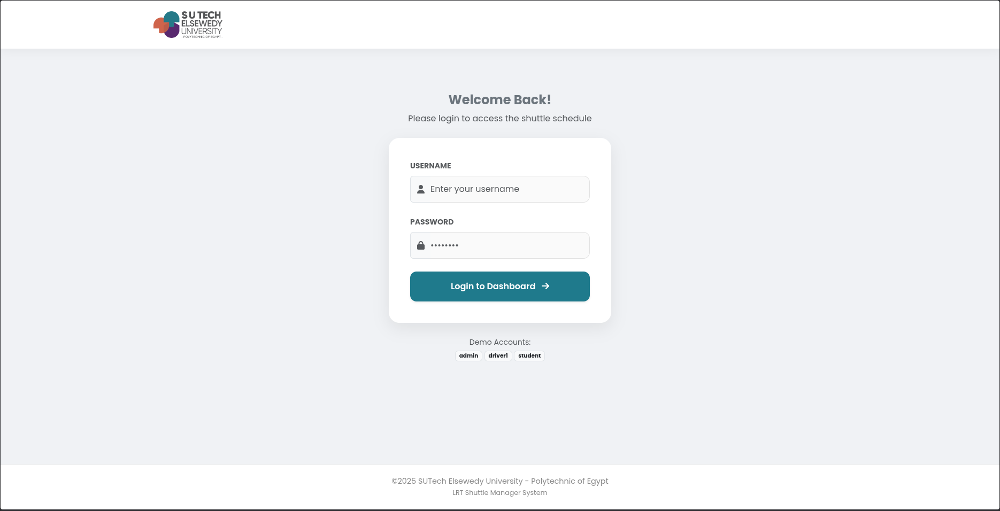
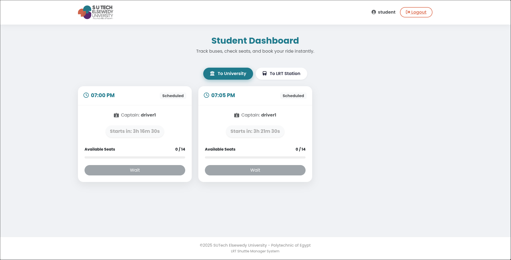
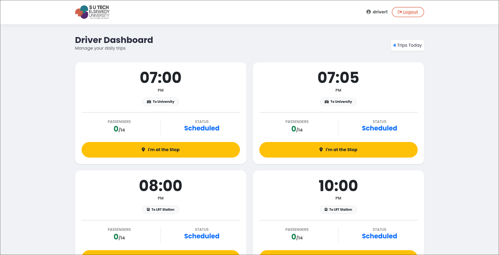
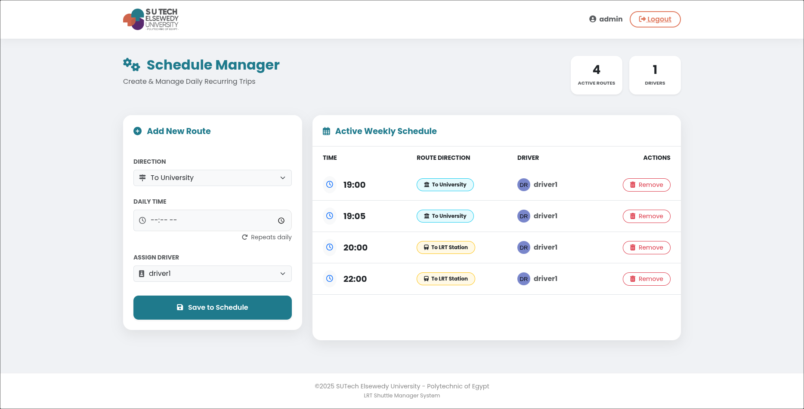

<div align="center">
  
  <h1>🚌 LRT Shuttle Bus Manager</h1>
  <p>
    <strong>A Smart Transportation System for SUTech Elsewedy University</strong>
  </p>

  <p>
    <a href="#-about-the-project">About</a> •
    <a href="#-key-features">Features</a> •
    <a href="#-screenshots">Screenshots</a> •
    <a href="#-tech-stack">Tech Stack</a> •
    <a href="#-how-to-run">Setup</a>
  </p>

  
  
  
  
</div>

---

## 📖 About The Project

The **LRT Shuttle Manager** is a Full-Stack web application designed to solve the daily transportation challenges at **SUTech Elsewedy University**.

Managing bus schedules manually leads to confusion, missed rides, and overcrowding. This system digitizes the entire process, connecting **Students**, **Drivers**, and **Admins** in real-time. It features automated scheduling, live countdown timers, and a smart seat booking engine.

---

## 📸 Project Showcase

### 🔐 Secure Login Portal
The gateway to the system with role-based redirection (Student, Driver, or Admin).
<br>

<br><br>

### 👨‍🎓 Student Dashboard
Real-time tracking with countdown timers that adapt based on driver status. Students can book seats only when the bus is approaching or boarding.
<br>

<br><br>

### 🚌 Driver Dashboard
A simplified, touch-friendly interface for drivers to update their status (`Scheduled` → `Boarding` → `Departed`) and view passenger counts.
<br>

<br><br>

### ⚙️ Admin Control Panel
The command center for managing daily schedules, creating recurring routes, and assigning drivers.
<br>


---

## 🚀 Key Features

| Role | Capabilities |
| :--- | :--- |
| **Students** | • View live countdowns (Hours/Minutes/Seconds).<br>• Book seats (Limits overbooking).<br>• Toggle between "To University" & "To LRT" routes.<br>• Auto-refreshing dashboard. |
| **Drivers** | • One-click status updates.<br>• See "Scheduled", "Boarding" (at stop), and "Departed" states.<br>• View number of booked passengers vs. capacity. |
| **Admins** | • Create daily recurring trip templates.<br>• Manage driver assignments.<br>• Delete or modify active routes. |

---

## 🛠️ Tech Stack

* **Backend:** Python (Flask Framework)
* **Database:** SQLite (SQLAlchemy ORM)
* **Frontend:** HTML5, CSS3, JavaScript (Vanilla), Bootstrap 5
* **Real-time Logic:** JS Polling (`setInterval`) & LocalStorage for state persistence.

---

## ⚙️ How to Run

1.  **Clone the repository**
    ```bash
    git clone [https://github.com/yousseftamerv1/lrt-shuttle-manager.git](https://github.com/yousseftamerv1/lrt-shuttle-manager.git)
    cd lrt-shuttle-manager
    ```

2.  **Create Virtual Environment (Optional but Recommended)**
    ```bash
    python -m venv venv
    # Windows
    venv\Scripts\activate
    # Mac/Linux
    source venv/bin/activate
    ```

3.  **Install Requirements**
    ```bash
    pip install flask flask_sqlalchemy
    ```

4.  **Run the App**
    ```bash
    python app.py
    ```
    *The database will initialize automatically on the first run.*

5.  **Access the App**
    Open `http://localhost:5000` in your browser.

---

## 🔐 Demo Credentials

Use these accounts to explore the system:

| Role | Username | Password |
| :--- | :--- | :--- |
| **Admin** | `admin` | `123` |
| **Driver** | `driver1` | `123` |
| **Student** | `student` | `123` |

---

## 👤 Author

**Youssef Tamer**
* Student at SUTech Elsewedy University - Polytechnic of Egypt
* Project Date: December 2025

---
<div align="center">
  <small>MVP build for a university project</small>
</div>
